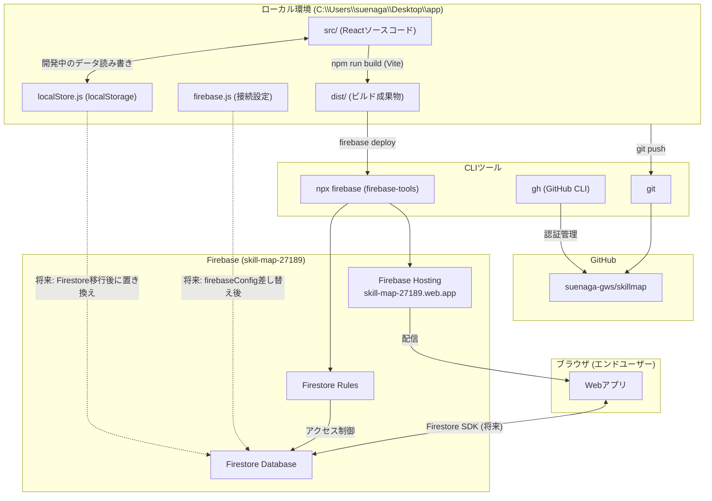

# スキルマップ

部門・チーム・個人の人材育成状況をRPGスキルツリー風UIで管理するWebアプリ。

## 公開URL

https://skill-map-27189.web.app

## 機能

- 部門 → チーム → メンバーの階層構造
- チームごとのスキルリスト（大分類・小分類）
- メンバーごとのスキルレベル管理（0〜4の4段階）
- RPGスキルツリー風UI（レベルに応じてノードが発光）
- スキル・メンバーのCRUD管理画面

## アーキテクチャ



**現状のデータフロー**
- ローカル開発中はデータを `localStorage` に保存
- `npm run build` → `npx firebase deploy` で Hosting にデプロイ
- 将来 `src/firebase.js` の設定を本番プロジェクトに向け直すと Firestore に移行

## 技術スタック

| 区分 | 技術 |
|------|------|
| フロントエンド | React + Vite |
| データ（ローカル） | localStorage |
| データ（本番予定） | Firebase Firestore |
| ホスティング | Firebase Hosting |
| コード管理 | GitHub |

## セットアップ

```bash
npm install
npm run dev
```

## デプロイ

```bash
npm run build
npx firebase deploy --token "YOUR_CI_TOKEN"
```

CI トークンの発行: `npx firebase login:ci`
