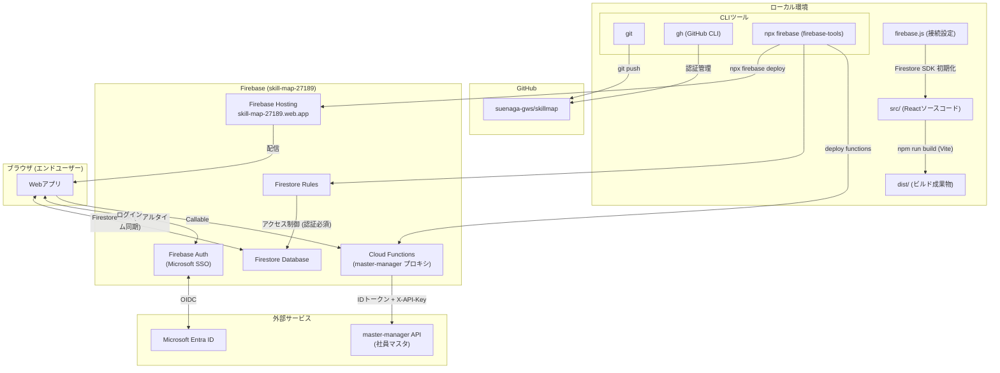
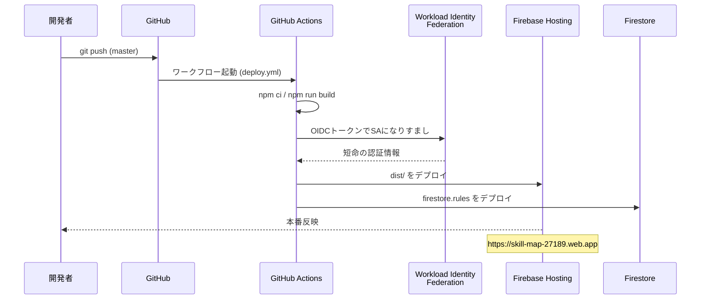

# スキルマップ

部門・チーム・個人の人材育成状況をRPGスキルツリー風UIで管理するWebアプリ。

## 公開URL

https://skill-map-27189.web.app

## 機能

- 部門 → チーム → メンバーの階層構造
- チームごとのスキルリスト（大分類・小分類）
- メンバーごとのスキルレベル管理（0〜4の4段階）
- RPGスキルツリー風UI（レベルに応じてノードが発光）
- スキル・メンバーのCRUD管理画面
- **Microsoft SSO ログイン**（社内テナント限定）
- **社員マスタ連携**（master-manager API から社員情報を取込・同期）
- **部門／チームの自動生成**（社員の deptCode から部門マスタを照合し、チームを自動構成・社員を自動割当）

## 技術スタック

| 区分 | 技術 |
|------|------|
| フロントエンド | React + Vite |
| データ | Firebase Firestore |
| 認証 | Firebase Authentication（Microsoft SSO / Entra） |
| サーバー処理 | Cloud Functions（asia-northeast1） |
| 外部連携 | master-manager 配信API（社員マスタ） |
| ホスティング | Firebase Hosting |
| コード管理 | GitHub |
| CI/CD | GitHub Actions（Workload Identity Federation でキーレス認証） |

## マスタ連携の設計原則

master-manager の仕様に準拠し、以下を厳守する。

- **社員キー（id）は不変** — Firestore の `members` ドキュメントIDに社員のUUIDを使用
- **氏名・メール等の属性はマスタが正** — 同期のたびに上書きし、ローカルはキャッシュのみ
- **APIキーはサーバー側のみ** — Cloud Functions の Secret に格納し、クライアントには一切出さない
- **配信APIはサーバー経由でのみ呼ぶ** — フロントは Callable Function を介して間接的に取得
- **組織構成はマスタが正** — 部門は `departments` マスタ、チームは `department-teams` マスタ（`parentDeptCode` で親部門に紐付け）から取得。社員は `custom.teamCode`（マスタの `code`）で所属チームに割当。`teamCode` 未設定の社員は「未所属」（擬似チームは作らない）。マスタに無い部門・チーム・表示OFF社員は同期時にローカルからも削除。チームの `skills` と社員の `skillLevels`（マスタに存在しないアプリ固有データ）は同期しても保持

## アーキテクチャ



## デプロイシーケンス

master へ push すると、GitHub Actions が Hosting と Firestore ルールを自動デプロイする。
認証は Workload Identity Federation（GitHub OIDC）で行い、鍵は保存しない。



Functions は変更頻度が低く権限も強いため自動デプロイ対象外。変更時のみローカルから：

```bash
npx firebase deploy --only functions
```

## セットアップ

```bash
npm install
npm run dev
```

## デプロイ手順

**通常はコードを master に push するだけで自動デプロイされる**（GitHub Actions）。

```bash
git add .
git commit -m "変更内容"
git push   # → Actions が Hosting / Firestore ルールを自動デプロイ
```

手動でデプロイする場合（Functions 含む全体）：

```bash
npm run build
npx firebase deploy
```

## 初期セットアップ（SSO / マスタ連携）

初回のみ必要な手動作業。

### 1. Firebase を Blaze プランに変更
Cloud Functions の利用には従量課金（Blaze）プランが必須。
Firebase コンソール → 「アップグレード」から変更する。

### 2. Microsoft SSO プロバイダを有効化
1. Firebase コンソール → Authentication → Sign-in method → Microsoft を有効化
2. 表示されるリダイレクトURI（`https://skill-map-27189.firebaseapp.com/__/auth/handler`）を控える
3. master-manager 管理者に上記URIの登録を依頼し、アプリケーションID／シークレットを受領
4. 受け取ったID／シークレットをコンソールの Microsoft プロバイダ設定に登録

### 3. master-manager API キーを Secret に登録
```bash
npx firebase functions:secrets:set MASTER_MANAGER_API_KEY
# プロンプトに mm_xxxx... を貼り付け
```

### 4. Cloud Functions をデプロイ
```bash
npx firebase deploy --only functions
```

### 5. サービスアカウントの認可
master-manager 管理者に、Functions のサービスアカウント
（`skill-map-27189@appspot.gserviceaccount.com`）への呼び出し許可付与を依頼する。

### 6. 社員の取込
アプリにログイン後、画面右下の「🔄 マスタ同期」を実行すると、
社員の取込・部門/チームの自動生成・社員の自動割当がまとめて行われる。
`deptCode` を持たない社員のみ、各チームの管理画面から手動で割り当てる。

---

## バージョン履歴

| バージョン | 日付 | 変更内容 |
|-----------|------|---------|
| v0.5 | 2026-07-10 | GitHub Actions による CI/CD を追加（PRでlint/build、masterへのpushでHosting・Firestoreルールを自動デプロイ、Workload Identity Federationでキーレス認証） |
| v0.4.2 | 2026-07-10 | マスタを組織構成の唯一の正に統一（擬似チームを廃止し teamCode 未設定者は未所属、マスタに無い部門・チームは同期時に削除） |
| v0.4.1 | 2026-07-10 | マスタ連携を実データ構造に整合（部門=departments／チーム=department-teams／社員=deptCode・teamCode で割当）、Cloud Functionsを本番デプロイ、認可をAPIキー単層に簡素化 |
| v0.4 | 2026-07-10 | Microsoft SSO ログインと社員マスタ連携（Cloud Functions プロキシ）を追加、deptCode から部門・チームを自動生成・社員を自動割当、Firestoreルールを認証必須に強化、サンプルデータを廃止 |
| v0.3.1 | 2026-07-01 | アーキテクチャ図のCLIツールをローカル環境ブロック内に移動 |
| v0.3 | 2026-07-01 | データ層を localStorage から Firestore に移行、firebase.js を本番設定に更新 |
| v0.2 | 2026-07-01 | Firebase Hosting へのデプロイ、GitHub リポジトリ公開 |
| v0.1 | 2026-07-01 | MVP 初回リリース（React + Vite + RPGスキルツリーUI） |
