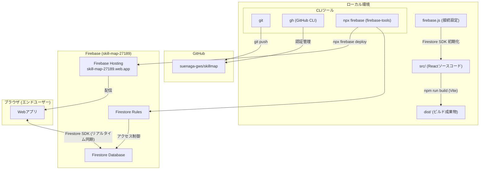
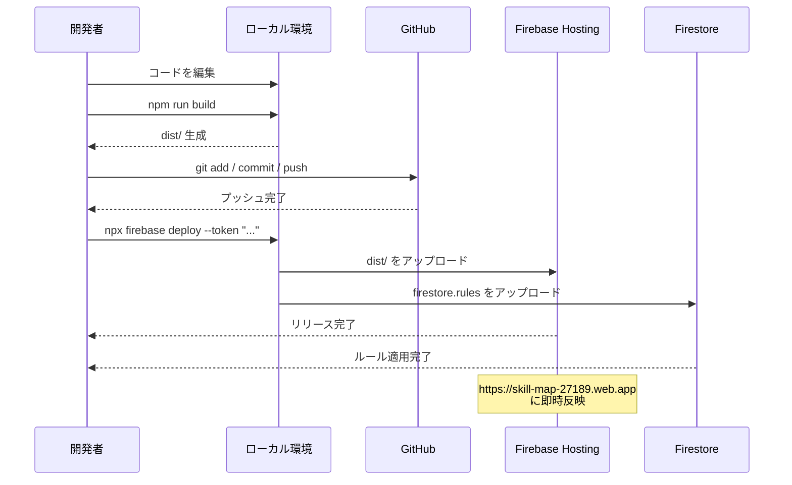

# スキルマップ

部門・チーム・個人の人材育成状況をRPGスキルツリー風UIで管理するWebアプリ。

## 公開URL

https://skill-map-27189.web.app

## 機能

- 部門 → チーム → メンバーの階層構造
- チームごとのスキルリスト（大分類・小分類）
- メンバーごとのスキルレベル管理（0〜4の4段階）
- RPGスキルツリー風UI（レベルに応じてノードが発光）
- スキル・メンバーのCRUD管理画面

## 技術スタック

| 区分 | 技術 |
|------|------|
| フロントエンド | React + Vite |
| データ | Firebase Firestore |
| ホスティング | Firebase Hosting |
| コード管理 | GitHub |

## アーキテクチャ



## デプロイシーケンス

コードに変更を加えたあと、本番環境へ反映するまでの手順。



## セットアップ

```bash
npm install
npm run dev
```

## デプロイ手順

```bash
# 1. ビルド
npm run build

# 2. GitHubにプッシュ
git add .
git commit -m "変更内容"
git push

# 3. Firebase にデプロイ
npx firebase deploy --token "YOUR_CI_TOKEN"
```

CI トークンの発行: `npx firebase login:ci`

---

## バージョン履歴

| バージョン | 日付 | 変更内容 |
|-----------|------|---------|
| v0.3.1 | 2026-07-01 | アーキテクチャ図のCLIツールをローカル環境ブロック内に移動 |
| v0.3 | 2026-07-01 | データ層を localStorage から Firestore に移行、firebase.js を本番設定に更新 |
| v0.2 | 2026-07-01 | Firebase Hosting へのデプロイ、GitHub リポジトリ公開 |
| v0.1 | 2026-07-01 | MVP 初回リリース（React + Vite + RPGスキルツリーUI） |
